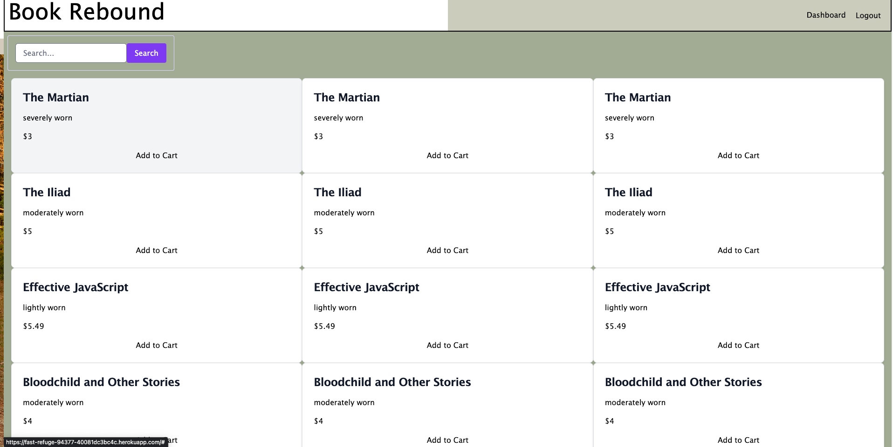
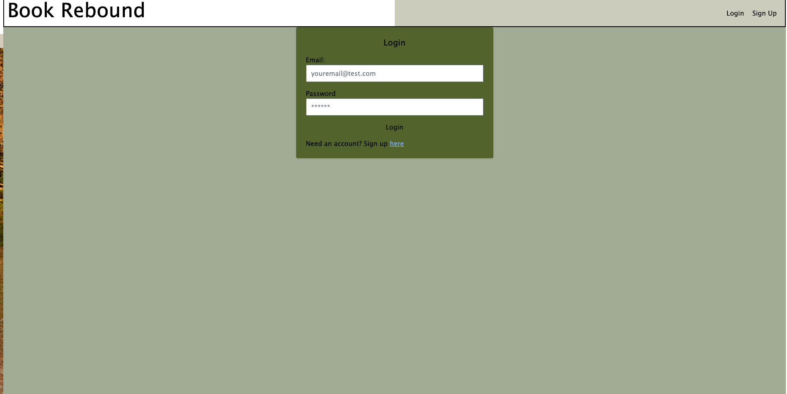
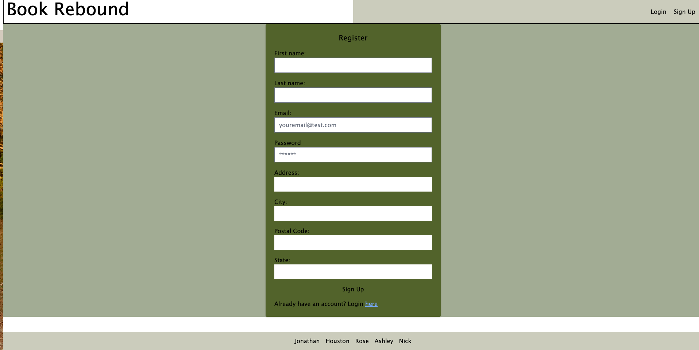
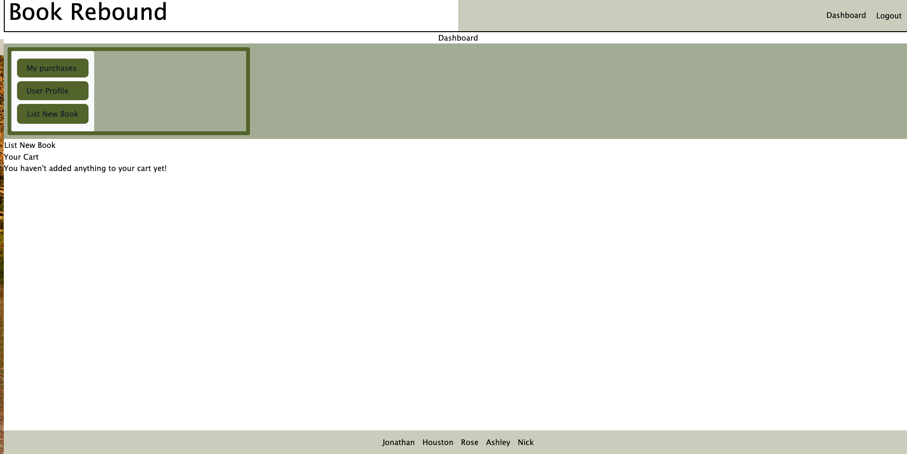
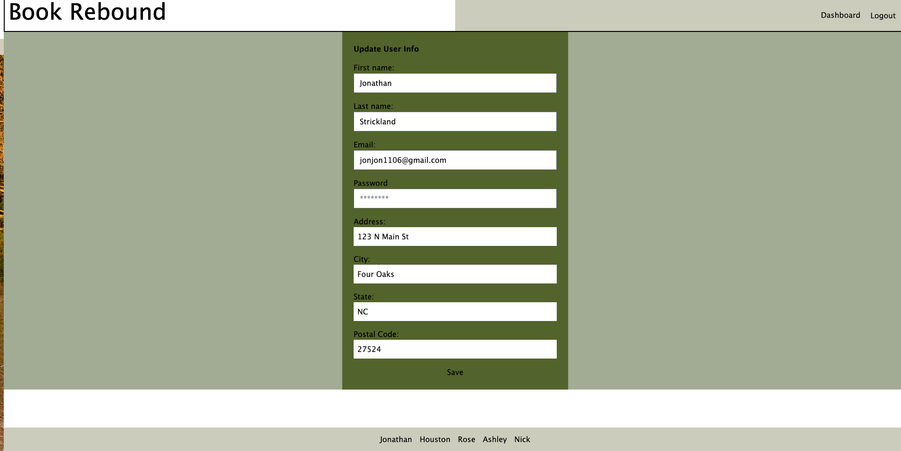

# Book Rebound

    
<h2>Table of Contents</h2>

- [Book Rebound](#book-rebound)
  - [Description](#description)
  - [License](#license)
  - [Technologies Used](#technologies-used)
  - [Screenshots](#screenshots)
  - [Deployed Application](#deployed-application)
  - [Acknowledgements](#acknowledgements)
  - [Contributors / Contact Info](#contributors--contact-info)

## Description

Are you a book lover looking to sell and buy books directly from other book lovers? Perhaps you're trying to self-publish and need some starting sales among like minded readers. Or looking for that elusive book to add to your collection. At Book Rebound you can do just that! \
Trade and sell your used or new books with others and keep feeding that your book worm needs. Users can find books of interest by author, genre, condition, price, and more. Sign up today and find that missing book you need.

## License

## Technologies Used

    
     

## Screenshots

Landing Page  Login Page  Signup Page  User Dashboard  Update User Page 

## Deployed Application

[Heroku link](https://fast-refuge-94377-40081dc3bc4c.herokuapp.com/) to application.

## Acknowledgements

Thank you to our instructor and all of the TA's for their ongoing support and expertise.

## Contributors / Contact Info

- Houston Culpepper [@hculp](https://github.com/hculp)
- Jonathan Strickland [@JonJonS06](https://github.com/JonJonS06)
- Ashley Braxton [@AshleyBraxton](https://github.com/AshleyBraxton)
- Rose H [@catfishcafe](https://github.com/catfishcafe)
- Nick Papazafiropoulos [@AddisonNoxy](https://github.com/AddisonNoxy)

[🔼 Back to Top](#book-rebound)
